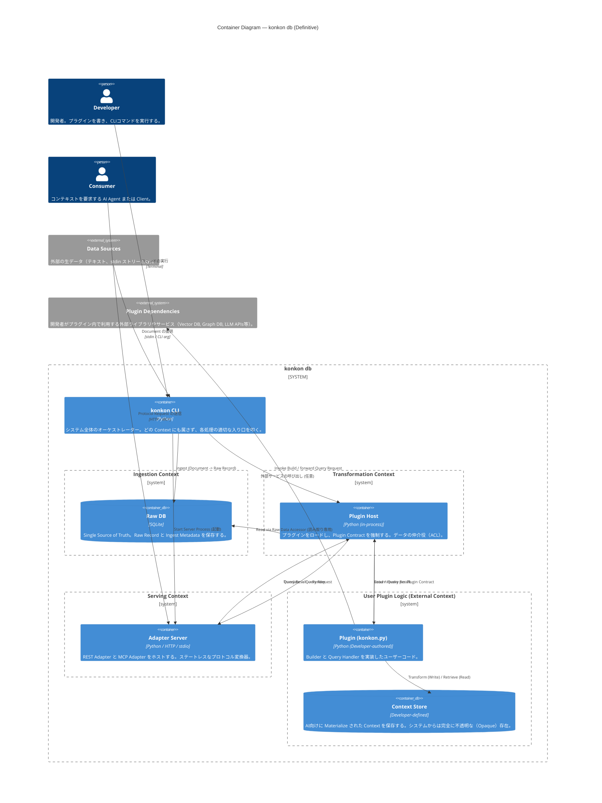
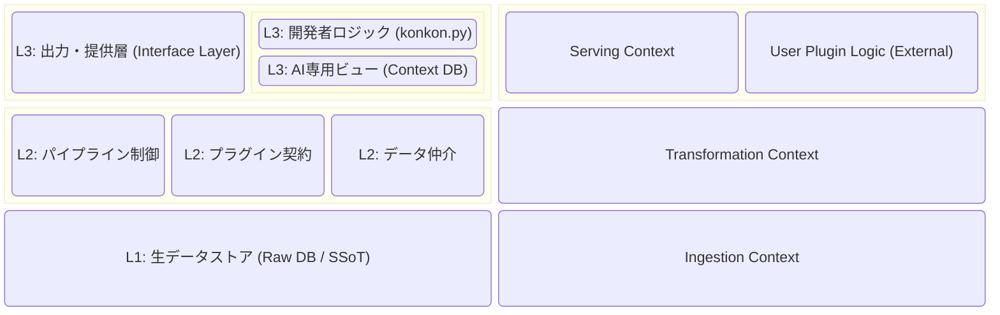

kk# 概念アーキテクチャ設計 (Conceptual Architecture)

本ドキュメントは `konkon db` の全体像を抽象的に定義し、システム内の責務の境界線（Bounded Contexts）と、コンポーネント間の関係性を明確にします。

## 1. 境界づけられたコンテキスト (Bounded Contexts)

`konkon db` は「Compute on Write（事前計算）」と「プラガブルなAI向けビュー」というコンセプトを実現するため、システムを **3つのコア/サポートコンテキスト** と **1つの外部コンテキスト** に分割します。

### 1.1 Ingestion Context (データ取り込みコンテキスト)
* **分類:** コア・ドメイン
* **責務:** 外部の生データを「Single Source of Truth（信頼できる唯一の情報源）」として取り込み、欠損なく永続化する。
* **所有するもの:** Raw DB（SQLite等）、データのパースロジック、投入メタデータ。
* **制約:** AI、ベクトル、コンテキストの構造に関する知識を**一切持たない**。純粋なデータの貯蔵庫である。

### 1.2 Transformation Context (変換・オーケストレーションコンテキスト)
* **分類:** コア・ドメイン
* **責務:** データ変換のパイプラインを管理し、開発者が定義した外部プラグイン（`konkon.py`）のライフサイクルと実行をオーケストレーションする。
* **所有するもの:** プラグイン・ホスト（実行環境）、ビルドのオーケストレーションロジック、プラグインとの「契約（Interface Contract）」。
* **制約:** 開発者がどのような Context DB（Vector DB等）を使うか、どういうスキーマにするかという**内部構造を知らない**。

### 1.3 Serving Context (提供コンテキスト)
* **分類:** サポート・ドメイン
* **責務:** CLI、REST API、MCPサーバーなどの外部プロトコルからの要求を受け付け、Transformation Context へ中継し、結果をフォーマットして返す。
* **所有するもの:** 各種プロトコルアダプター、サーバーライフサイクル管理。
* **制約:** **完全にステートレス**。ビジネスロジックを持たず、Raw DB や Context DB に**直接アクセスすることは絶対にない**。

### 1.4 User Plugin Logic (ユーザー・プラグイン・ロジック)
* **分類:** 外部 / パートナー・コンテキスト
* **責務:** 開発者が記述する `konkon.py` (`build()`, `query()`) の振る舞い。
* **所有するもの:** 開発者が選定した **Context DB** （およびそのスキーマやView定義）、独自のデータ変換・検索ロジック。
* **制約:** Transformation Context が提示する「契約（関数のシグネチャと引数）」に完全に従う（Conformist）。

---

## 2. コンテキスト・マップ (Context Map と 依存関係)

各コンテキストがどのように連携し、どこに**腐敗防止層（ACL: Anti-Corruption Layer）**が設けられているかを示します。

```text
[External Data Sources]
       │
       ▼
┌───────────────────────┐
│ Ingestion Context     │ (Raw DB を所有)
└─────────┬─────────────┘
          │ (Upstream → Downstream)
          │ ACL: 読み取り専用の Raw Data Accessor
          ▼
┌───────────────────────┐       (Upstream → Downstream)      ┌───────────────────────┐
│ Transformation Context│ ──────── ACL: query() の戻り値 ───▶│ Serving Context       │
└─────────┬─────────────┘                                    └───────────────────────┘
          │
          │ Host → Partner (Published Language / Conformist)
          │ ACL: プラグイン・コントラクト (build/query の型定義)
          ▼
╔═══════════════════════╗
║ User Plugin Logic     ║ (External Context)
║ [Context DB を所有]   ║
╚═══════════════════════╝
```

### 2.1 境界における厳密なルール (Anti-Corruption Layers)

アーキテクチャの脆さを防ぐため、以下の境界ルールを強制します。

1. **Raw DB の隔離 (Ingestion → Transformation):**
   Transformation 層および User Plugin は、Raw DB に直接 SQL を発行することはできません。システムが提供する「正規化されたデータリーダー（Accessor）」を通じてのみデータを読み取ります。
2. **Context DB の不透明性 (Transformation ↔ User Plugin):**
   システム側は、User Plugin が作成した Context DB の中身（テーブルやViewの定義）を一切知りません。「`build`関数にデータを渡し、`query`関数にリクエストを渡せば結果が返ってくる」という契約のみに依存します。
3. **Serving 層の無知 (Transformation → Serving):**
   Serving 層は `query()` の実行結果（文字列やJSON）を受け取るだけであり、それがどのように検索されたか、元のデータが何であったかを知りません。これにより、特定のAIインターフェース（例: MCP）がシステムの内部構造に結合することを防ぎます。

---

## 3. ユビキタス言語 (Ubiquitous Language)

DDDの原則に従い、各コンテキスト内で使用される公式な用語（名詞と動詞）を定義します。
重要な設計ルールとして、**「データがコンテキストの境界（ACL）を越えるとき、その呼び名は必ず変わる」** ことを強制します。これにより、ドメインの漏出をコードレベルで防ぎます。

### 3.1 Ingestion Context
生データの「保管と管理」に関する言葉のみを使用します。AIや検索に関する用語は使用禁止です。

| 用語 (English) | 種類 | 定義 |
| :--- | :--- | :--- |
| **Document** | Noun | ユーザーから提供された入力テキストやペイロード。永続化される前の一時的な状態。 |
| **Raw Record** | Noun | `Raw DB` に永続化されたデータ。元のコンテンツにシステム管理のメタデータが付与されたもの。 |
| **Ingest Metadata** | Noun | `Raw Record` に付随するメタデータ（追記日時（システム管理）およびユーザー定義の任意メタデータ（JSON））。 |
| **Raw DB** | Noun | すべての `Raw Record` を格納する永続化ストア（例: SQLite）。システムの Single Source of Truth。 |
| **Ingest** | Verb | `Document` を受け取り、メタデータ（`meta`）を付与して `Raw Record` として `Raw DB` に保存する行為。 |

* **🚫 使用禁止用語:** Context, Build, Query, Plugin, Adapter, Store

### 3.2 Transformation Context
「オーケストレーションと契約（Contract）」に関する言葉を使用します。プラグイン内部のストレージ構造に関する用語は使用禁止です。

| 用語 (English) | 種類 | 定義 |
| :--- | :--- | :--- |
| **Plugin** | Noun | 開発者が提供するモジュール（例: `konkon.py`）。 |
| **Plugin Contract** | Noun | プラグインが満たすべき関数のシグネチャ（`build()`, `query()`）と型の定義。 |
| **Plugin Host** | Noun | `Plugin` をロードし、実行し、ライフサイクルを管理するフレームワーク側のランタイム。 |
| **Raw Data Accessor** | Noun | `Plugin` の `build()` に渡される読み取り専用のインターフェース。`Raw DB` のスキーマを隠蔽する。 |
| **Query Request** | Noun | Serving層から渡される、プロトコルに依存しない正規化された検索リクエスト。 |
| **Query Result** | Noun | `Plugin` の `query()` から返される正規化された結果（文字列やJSON）。 |
| **Load** / **Invoke** | Verb | プラグインを読み込む行為 / プラグインの関数（契約）を呼び出す行為。 |

* **🚫 使用禁止用語:** Document, Raw DB (直接アクセスしないため), Context Store (内部を知らないため), Response

### 3.3 Serving Context
「プロトコルと転送」に関する言葉のみを使用します。ビジネスロジックやデータ構造に関する用語は使用禁止です。

| 用語 (English) | 種類 | 定義 |
| :--- | :--- | :--- |
| **Consumer** | Noun | コンテキストを要求する外部の存在（CLIユーザー、AIエージェント、MCPクライアント）。 |
| **Protocol Request** | Noun | 受信したプロトコル固有のリクエスト（HTTPボディ、MCPツールコール引数など）。 |
| **Protocol Response**| Noun | `Consumer` に返すプロトコル固有のフォーマットでラップされた結果。 |
| **Adapter** | Noun | リクエストの受信とレスポンスの返却を行うモジュール（CLI Adapter, REST Adapter, MCP Adapter）。 |
| **Translate** | Verb | `Protocol Request` を Transformation 層が理解できる `Query Request` に変換する行為。 |
| **Render** | Verb | `Query Result` を `Protocol Response` にフォーマットする行為。 |

* **🚫 使用禁止用語:** Raw Record, Raw DB, Plugin, Context Store, Query Logic

### 3.4 User Plugin Logic (External Context)
開発者の自由なドメインです。AIや変換、検索に関する具体的な言葉を使用します。

| 用語 (English) | 種類 | 定義 |
| :--- | :--- | :--- |
| **Builder** | Noun | 生データをAI向けに変換する開発者定義のロジック（`build()` の中身）。 |
| **Query Handler** | Noun | 検索要求を受け取り、データを引き出す開発者定義のロジック（`query()` の中身）。 |
| **Context Store** | Noun | 開発者が選定・構築したAI向けのデータストア（Vector DB、SQLiteビュー、Markdown群など）。 |
| **Context** | Noun | `Context Store` 内に保存されている、AI向けに最適化された（Materializedされた）データ。 |
| **Transform** | Verb | 生データをAIが理解しやすい形（Context）に変換・要約・ベクトル化する行為。 |
| **Retrieve** | Verb | `Context Store` から要件に合致する `Context` を抽出する行為。 |

### 3.5 境界における用語の変換 (Boundary Translation)
データがシステム内を流れる際、コンテキストの境界（ACL）を越えるたびに以下のように「名前」が変わり、依存関係が断ち切られます。

| 元の概念          | Ingestion 層での呼称 | Transformation 層での呼称          | User Plugin 内での呼称 | Serving 層での呼称         |
| :------------ | :-------------- | :---------------------------- | :---------------- | :-------------------- |
| 外部からの入力データ   | **Document**    | (扱わない)                        | (扱わない)            | (扱わない)                |
| DBに保存されたデータ   | **Raw Record**  | **Raw Data Accessor** (背後に隠蔽) | `raw_data` (引数)   | (扱わない)                |
| クライアントからの検索要求 | (扱わない)          | **Query Request**             | `request` (引数)    | **Protocol Request**  |
| 検索の最終結果       | (扱わない)          | **Query Result**              | (関数の戻り値)          | **Protocol Response** |
| 開発者が作ったDB     | (扱わない)          | (扱わない - 不透明)                  | **Context Store** | (扱わない)                |

---

## 4. C4 モデル (Level 1 & Level 2)

前述のコンテキスト境界とユビキタス言語に基づき、システムの動的なコンテナ構成を定義します。

### 4.1 C4 Level 2: Container Diagram

この図は、`konkon db` の内部コンポーネント（コンテナ）と、それらがどの Bounded Context に属しているか、またそれらがどのようにデータをやり取りするか（ACLの遵守）を示しています。



### 4.2 アーキテクチャの重要ポイント (ACL の証明)

上記の C4 モデルは、アーキテクチャの脆さを防ぐための以下のルール（MUST NOT）を構造的に証明しています。

1. **CLI は Adapter ではない:** CLI実行ファイルは特定の Context に縛られず、全体を俯瞰するオーケストレーターとして配置されています。これにより「Serving 層から Raw DB への書き込み」という矛盾を回避しています。
2. **Serving 🚫 Raw DB / Context Store:** `Adapter Server` からは、どの DB にも矢印が伸びていません。サーバーは完全にステートレスであり、`Plugin Host` との間で `Query Request` / `Query Result` をやり取りするだけです。
3. **Transformation 🚫 Context Store:** `Plugin Host` すらも、開発者の `Context Store` にはアクセスできません。
4. **Plugin 🚫 Raw DB:** ユーザーの `Plugin` が `Raw DB` に直接アクセスする矢印はありません。必ず `Plugin Host` が提供する `Raw Data Accessor` を通じて安全にデータを読み取ります。

### 4.3 概念構成図（レイヤー図）

システム全体の構造をよりシンプルに視覚化するためのレイヤー図（ブロック図）です。コンテキストの階層（インターフェース層、エンジン層、データ層）と、フレームワークとユーザーロジックの境界を明確にしています。


