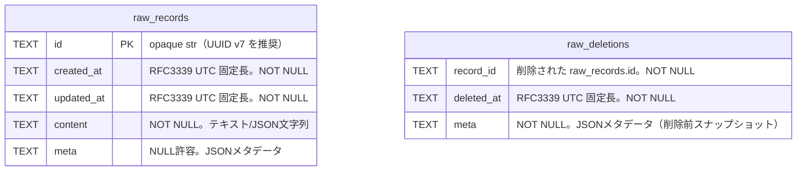

# データモデル設計 (Raw DB Data Model)

本ドキュメントは、**Ingestion Context** が所有する Raw DB（SQLite）の物理スキーマを定義する。

設計の前提:
- `docs/design/01_conceptual_architecture.md` の境界設計（ACL / Bounded Contexts）
- `docs/design/02_interface_contracts.md` で確定した `RawRecord` / `RawDataAccessor.since()` の契約

## 1. スコープと非スコープ

### 1.1 スコープ

- Raw DB の論理モデル（Raw Record の保持）
- SQLite 物理スキーマ（テーブル、列、制約、インデックス）
- `RawDataAccessor` へのマッピング規約（ACL #1 の観点）
- `since()` を成立させるための順序・時刻表現・インデックス設計
- ID 生成戦略、SQLite 運用設定、マイグレーション方針

### 1.2 非スコープ

- User Plugin が所有する `Context Store` のスキーマ（ACL #2: 不透明）
- `build()` / `query()` の内部アルゴリズム
- REST / MCP のプロトコル仕様（Serving Context）

---

## 2. 設計原則（ACL と境界保護）

`01_conceptual_architecture.md` の原則に従い、Raw DB は Ingestion Context の内部実装であり、外部に対しては **Raw Data Accessor** のみを公開する。

### 2.1 MUST ルール

1. **Plugin は Raw DB に直接 SQL を発行してはならない**
2. **Transformation Context も Raw DB の物理スキーマに依存してはならない**
3. **`RawDataAccessor` が Raw DB のスキーマ差異・将来のマイグレーションを吸収する**
4. **ACL を越えるデータは `RawRecord` として正規化される**
5. **Raw DB は append-only を基本とする** — UPDATE は `updated_at` タイムスタンプ付きで許容される。DELETE はレコード単位の物理削除を許容し、同一トランザクションで `raw_deletions` に tombstone（削除時点の `meta` を含む）を記録する

### 2.2 設計上の含意

- テーブル名・インデックス名・内部補助列は **公開 API ではない**
- `RawRecord` は ACL 境界の DTO であり、SQLite の行をそのまま露出しない
- 将来、Raw DB に内部列（監査用・最適化用等）を追加しても、`RawDataAccessor` が `RawRecord` に投影する限りプラグイン互換性は保たれる

---

## 3. ER 図



`raw_deletions.record_id` は `raw_records` から削除されたレコードの ID を保持する。削除処理は `raw_records` の DELETE と `raw_deletions` への INSERT を同一トランザクションで実行する（外部キー制約は使用しない）。

---

## 4. `RawRecord` と Raw DB の対応（ACL マッピング）

`RawRecord` の型定義は [02_interface_contracts.md §1](./02_interface_contracts.md) を参照。

`source_uri` / `content_type` は `meta` JSON のキーとして格納され、`RawDataAccessor` が `RawRecord` の property として投影する。なお、将来 Raw DB に内部列（監査用・最適化用等）を追加することは許容される — `RawDataAccessor` が `RawRecord` に投影する限りプラグイン互換性は保たれる（セクション 2.2 参照）。

| `RawRecord` フィールド | SQLite 列名 | 型 | NULL | 説明 |
| :--- | :--- | :--- | :--- | :--- |
| `id` | `id` | `TEXT` | NOT NULL | Raw Record の安定識別子。ACL 境界では opaque `str` |
| `created_at` | `created_at` | `TEXT` | NOT NULL | UTC 正規化された固定長 RFC3339 文字列 |
| `updated_at` | `updated_at` | `TEXT` | NOT NULL | UTC 正規化された固定長 RFC3339 文字列。INSERT 時は created_at と同値 |
| `content` | `content` | `TEXT` | NOT NULL | テキスト/JSON/CSV 等の文字列コンテンツ |
| `meta` | `meta` | `TEXT` | NULL 許可 | JSONメタデータ（`source_uri` / `content_type` 等） |

---

## 5. ID 生成戦略: UUID v7（推奨デフォルト）

ACL 契約上、`RawRecord.id` は opaque な `str` であり、フォーマットの強制はない。ただし Raw DB の内部実装として、以下の理由から **UUID v7** を推奨デフォルトとする。

### 5.1 選定理由

| 要件 | UUID v7 の適合性 |
| :--- | :--- |
| `RawRecord.id` が `str` 型 | ハイフン付き標準形式の文字列として格納可能 |
| `ORDER BY id ASC` の副次ソート | ミリ秒精度のタイムスタンプが先頭48bitに含まれ、辞書順で時間順になる |
| 分散環境での衝突回避 | 74bitのランダム部により実質的に衝突しない |
| 標準準拠 | RFC 9562 準拠 |

### 5.2 生成フォーマット

```
xxxxxxxx-xxxx-7xxx-yxxx-xxxxxxxxxxxx
^^^^^^^^      ^
|             version = 7
48-bit Unix timestamp (ms)
```

- 保存形式: ハイフン付き小文字の標準形式（36文字）
- 例: `019516a0-3b40-7f8a-b12c-4e5f6a7b8c9d`

### 5.3 `created_at` との関係

UUID v7 の先頭タイムスタンプと `created_at` は **論理的に同一時刻**から生成される。ただし `created_at` が正規のソートキーであり、UUID v7 の時間順序性は決定的 tie-break における副次的な利点として扱う。

> **注意:** `id` の辞書順ソートが厳密にingest順序を保証するとは限らない（UUID v7 の monotonic/non-monotonic は実装依存）。順序の正式な保証は `(created_at, id)` の複合キーによる。

---

## 6. 日時の保存形式

### 6.1 RFC3339 UTC 固定長文字列

`created_at` は SQLite の `TEXT` 型に以下の固定長形式で保存する。

```
YYYY-MM-DDTHH:MM:SS.ffffffZ
```

- 固定長: **27文字**
- 例: `2026-02-27T12:34:56.789012Z`

### 6.2 設計根拠

| 考慮点 | 判断 |
| :--- | :--- |
| SQLite に専用の datetime 型がない | TEXT が最も安全で可搬性が高い |
| `since()` の `WHERE created_at > ?` | 固定長 UTC 文字列は辞書順比較で正しい時系列順になる |
| マイクロ秒精度 | Python `datetime` のデフォルト精度を欠損なく保持 |
| タイムゾーン | 常に `Z` サフィックスで UTC であることを保証 |

### 6.3 保存時の正規化ルール

1. **必ず UTC に変換**してから保存する。
2. **`Z` サフィックスを必ず付与**する。
3. **マイクロ秒を常に6桁で保存**する（`.000000` であっても省略しない。固定長にすることで比較の信頼性を確保する）。

> **注意:** DB の CHECK 制約は canonical 形式の最低限検証（固定長・区切り文字・`Z` サフィックス）であり、日時値そのものの厳密な妥当性（月=13 等）は Ingestion 実装で検証する。

---

## 7. 物理スキーマ（SQLite）

### 7.1 テーブル設計: `raw_records`

```sql
CREATE TABLE IF NOT EXISTS raw_records (
    id           TEXT PRIMARY KEY COLLATE BINARY,
    created_at  TEXT NOT NULL,
    updated_at  TEXT NOT NULL,
    content      TEXT NOT NULL,
    meta         TEXT,

    -- ACL 境界 DTO の前提を守るための最小制約
    CHECK (id <> ''),
    CHECK (meta IS NULL OR (json_valid(meta) AND json_type(meta) = 'object')),

    -- Canonical RFC3339 UTC fixed-width: YYYY-MM-DDTHH:MM:SS.ffffffZ (27 chars)
    CHECK (length(created_at) = 27),
    CHECK (substr(created_at, 5, 1)  = '-'),
    CHECK (substr(created_at, 8, 1)  = '-'),
    CHECK (substr(created_at, 11, 1) = 'T'),
    CHECK (substr(created_at, 14, 1) = ':'),
    CHECK (substr(created_at, 17, 1) = ':'),
    CHECK (substr(created_at, 20, 1) = '.'),
    CHECK (substr(created_at, 27, 1) = 'Z'),

    CHECK (length(updated_at) = 27),
    CHECK (substr(updated_at, 5, 1)  = '-'),
    CHECK (substr(updated_at, 8, 1)  = '-'),
    CHECK (substr(updated_at, 11, 1) = 'T'),
    CHECK (substr(updated_at, 14, 1) = ':'),
    CHECK (substr(updated_at, 17, 1) = ':'),
    CHECK (substr(updated_at, 20, 1) = '.'),
    CHECK (substr(updated_at, 27, 1) = 'Z')
) STRICT;
```

#### 列ごとの設計意図

- **`id`**: `TEXT PRIMARY KEY`（opaque な文字列 ID）。比較順序の再現性のため `COLLATE BINARY`。同一 `created_at` 内の決定的 tie-break に利用。
- **`created_at`**: `since()` の比較キー。`ORDER BY created_at ASC, id ASC` の先頭キー。SQLite の暗黙 datetime 変換に依存せず、アプリで厳密に正規化して保存。
- **`content`**: `RawRecord.content: str` に合わせ `TEXT NOT NULL`。JSON/CSV/TXT/Markdown 等は文字列として保存。
- **`meta`**: NULL 許可の JSON オブジェクト。`source_uri` / `content_type` などの任意メタデータを格納する。`CHECK (json_valid AND json_type='object')` で妥当性を担保する。

#### `STRICT` テーブル採用方針

- **採用理由:** SQLite における型ゆらぎ（例: `created_at` に数値が混入）を抑制し、ACL DTO (`RawRecord`) と物理表現の整合性を高める。
- **前提:** SQLite 3.38+（`json_valid()` と `json_type()` を利用可能な前提）。

### 7.2 テーブル設計: `raw_deletions`

削除イベント（tombstone）を保持する補助テーブル。`raw_records` から削除されたレコードの ID と、削除時刻、削除前の `meta` を保存する。

```sql
CREATE TABLE IF NOT EXISTS raw_deletions (
    record_id   TEXT NOT NULL,
    deleted_at  TEXT NOT NULL,
    meta        TEXT NOT NULL DEFAULT '{}',

    CHECK (record_id <> ''),
    CHECK (json_valid(meta)),
    CHECK (json_type(meta) = 'object'),

    CHECK (length(deleted_at) = 27),
    CHECK (substr(deleted_at, 5, 1)  = '-'),
    CHECK (substr(deleted_at, 8, 1)  = '-'),
    CHECK (substr(deleted_at, 11, 1) = 'T'),
    CHECK (substr(deleted_at, 14, 1) = ':'),
    CHECK (substr(deleted_at, 17, 1) = ':'),
    CHECK (substr(deleted_at, 20, 1) = '.'),
    CHECK (substr(deleted_at, 27, 1) = 'Z')
) STRICT;
```

設計意図:
- **`record_id`**: 削除された `raw_records.id` を保持する stable key。`TEXT NOT NULL`。PRIMARY KEY / UNIQUE 制約なし — Tombstone は transient（ビルド後に purge）のため一意性制約は不要（[06_build_context.md §4.2](./06_build_context.md) 参照）
- **`meta`**: 削除前の `raw_records.meta` を JSON オブジェクトとして保持。Plugin が削除時にメタ情報を参照して Context Store を更新できるようにする
- **トランザクション要件**: `SELECT COALESCE(meta, '{}') FROM raw_records WHERE id = ?` → `DELETE FROM raw_records WHERE id = ?` → `INSERT INTO raw_deletions (...)` を同一トランザクションで実行し、原子性を保証する。`raw_records.meta` が NULL の場合は `COALESCE` で `'{}'` に正規化する

### 7.3 インデックス設計

[02_interface_contracts.md](./02_interface_contracts.md) で定義された順序・フィルタ要件を満たすため、以下の複合インデックスを **必須**とする。

```sql
CREATE INDEX IF NOT EXISTS idx_raw_records_created_at_id
    ON raw_records (created_at ASC, id ASC);

CREATE INDEX IF NOT EXISTS idx_raw_records_updated_at_id
    ON raw_records (updated_at ASC, id ASC);

CREATE INDEX IF NOT EXISTS idx_raw_deletions_deleted_at
    ON raw_deletions (deleted_at ASC, record_id ASC);
```

**設計根拠:**

1. **WHERE 句**: `created_at > ?` のレンジスキャンにインデックスを使用。
2. **ORDER BY 句**: `created_at ASC, id ASC` がインデックスの順序と一致するため、追加のソートが不要（filesort 回避）。
3. **全件イテレーション** (`__iter__`): WHERE 句なしの場合もこのインデックスで ORDER BY の最適化が効く。

> **カバリングインデックスについて:** `content` カラムが大きいため、全カラムを含むカバリングインデックスは現実的でない。インデックスによるレンジスキャンとソート回避の効果が支配的。

#### MVP で追加インデックスを最小化する理由

MVP では Raw DB への主要アクセスパターンは以下に限られる:

- 追記（INSERT）
- 全件走査（build）
- 時刻ベース差分走査（incremental build）
- 件数確認（`__len__`）
- 削除イベント走査（`deleted_at > ?`）

書き込み性能と実装単純性を優先し、必須インデックスは `idx_raw_records_created_at_id`、`idx_raw_records_updated_at_id`、`idx_raw_deletions_deleted_at` の3つとする。後者2つはインクリメンタルビルド（`updated_at > ?` / `deleted_at > ?`）の最適化に必要である。

---

## 8. SQLite 運用設定

データベース接続時に **毎回** 以下の PRAGMA を設定する。これらはセッション単位の設定であり（`journal_mode` を除く）、接続ごとに再設定が必要である。

```sql
PRAGMA journal_mode = WAL;        -- 永続設定（DB ファイルに記録される。初回のみ有効）
PRAGMA busy_timeout = 5000;       -- セッション設定（接続ごとに再設定が必要）
PRAGMA foreign_keys = ON;         -- セッション設定
PRAGMA synchronous = NORMAL;      -- セッション設定
```

| PRAGMA | 値 | 理由 |
| :--- | :--- | :--- |
| `journal_mode` | `WAL` | `konkon ingest`（書き込み）と `konkon build`（`RawDataAccessor` 経由の読み取り）が並行実行される場合、WAL モードによりリーダー/ライターのブロッキングを回避する。 |
| `busy_timeout` | `5000` | 複数プロセスが同時に Raw DB にアクセスした場合のライターロック待機（最大5秒）。 |
| `foreign_keys` | `ON` | 現時点では外部キーを使用しないが、将来のスキーマ拡張に備えてデフォルトで有効化。 |
| `synchronous` | `NORMAL` | WAL モードでは `NORMAL` でもクラッシュ安全性が確保される（WAL チェックポイント時に fsync）。 |

---

## 9. スキーマバージョニング

Raw DB のバージョン管理は ACL の内側に閉じ込める。プラグインはこれを認識しない。

- 方式: `PRAGMA user_version`
- 初期値: `3`（本ドキュメントのスキーマ）

将来 `raw_records` に内部列を追加しても、`RawDataAccessor` が `RawRecord` に投影する限り ACL 互換性は維持される。

---

## 10. マイグレーション戦略

### 10.1 初期化 (Version 0 → 3)

データベースファイルが存在しない、または `PRAGMA user_version = 0` の場合、セクション 12 の DDL を実行して Version 3 のスキーマを直接作成する。

### 10.2 マイグレーション (Version 1 → 2)

Version 1（`updated_at` 列なし）のデータベースが検出された場合、以下を自動適用する:
1. `raw_records` テーブルを再作成し、`updated_at` 列を追加（既存レコードは `updated_at = created_at` で埋める）。
2. `idx_raw_records_updated_at_id` インデックスを作成。
3. `PRAGMA user_version = 2` を設定。

### 10.3 マイグレーション (Version 2 → 3)

Version 2 のデータベースが検出された場合、以下を自動適用する:
1. `raw_deletions` テーブルを作成（`record_id`, `deleted_at`, `meta`）。
2. `idx_raw_deletions_deleted_at` インデックスを作成。
3. `PRAGMA user_version = 3` を設定。

### 10.4 未知バージョンの拒否

`PRAGMA user_version` がアプリケーションの `_CURRENT_VERSION`（現在: 3）より大きい場合、互換性のないスキーマとして即座にエラーとし、終了コード `3` (CONFIG_ERROR) で終了する。

### 10.5 将来のマイグレーション手順

1. DB 接続時に `PRAGMA user_version` を読み取る。
2. アプリケーションが期待するバージョンと比較する。
3. 差分がある場合、バージョン順にマイグレーション関数を適用する。
4. マイグレーション完了後、`PRAGMA user_version = N` を設定する。
5. 未知バージョン（アプリより新しい）の場合はエラーとする。

---

## 11. `RawDataAccessor` の SQL マッピング

`RawDataAccessor` の各メソッドが内部で発行する SQL クエリの対応表。これは実装ガイドであり、ACL #1 の背後に隠蔽される。

| メソッド | 発行される SQL | 使用インデックス |
| :--- | :--- | :--- |
| `__iter__()` | `SELECT id, created_at, updated_at, content, meta FROM raw_records ORDER BY created_at ASC, id ASC` | `idx_raw_records_created_at_id` |
| `__len__()` | `SELECT COUNT(*) FROM raw_records` | (内部最適化) |
| `since(ts)` → `__iter__()` | `SELECT ... FROM raw_records WHERE created_at > ? ORDER BY created_at ASC, id ASC` | `idx_raw_records_created_at_id` (レンジスキャン) |
| `since(ts)` → `__len__()` | `SELECT COUNT(*) FROM raw_records WHERE created_at > ?` | `idx_raw_records_created_at_id` |
| `modified_since(ts)` | `SELECT id, created_at, updated_at, content, meta FROM raw_records WHERE updated_at > ? ORDER BY created_at ASC, id ASC` | `idx_raw_records_updated_at_id` |

### 11.1 行 → `RawRecord` 変換規約（読み取りパス）

`raw_records` の1行を `RawRecord` に変換する際の必須ルール:

- `created_at` (TEXT) → `RawRecord.created_at` (datetime): RFC3339 UTC 文字列をパースし、**必ず timezone-aware UTC の `datetime`** に変換する。naive `datetime` を生成してはならない。
- `updated_at` (TEXT) → `RawRecord.updated_at` (datetime): `created_at` と同様に RFC3339 UTC 文字列をパースし、**必ず timezone-aware UTC の `datetime`** に変換する。
- `meta` (TEXT / NULL) → `RawRecord.meta` (Mapping): `NULL` は空 dict `{}` にマッピングする。文字列は JSON パースし、失敗時は空 dict `{}` として扱い診断ログを出力する。
- `source_uri` / `content_type` は `RawRecord.meta` から property として自動投影される。
- その他のフィールドはそのまま `str` にマッピングする。

### 11.2 `since(timestamp)` のシリアライズ規約（書き込みパス）

`RawDataAccessor.since(timestamp)` 実装時、引数 `timestamp: datetime` について以下を必須とする:

1. `timestamp` は timezone-aware であることを検証する。
2. UTC であること（`utcoffset() == timedelta(0)`）を検証する。
3. Canonical 形式 `YYYY-MM-DDTHH:MM:SS.ffffffZ` にシリアライズする。
4. `WHERE created_at > ?` にバインドして実行する。
5. 結果は必ず `ORDER BY created_at ASC, id ASC` で返す。

### 11.3 Ingest 操作の SQL（参考）

`RawDataAccessor` のスコープ外であるが、Ingestion Context 内部で使用される書き込み操作を参考として記載する。

```sql
INSERT INTO raw_records (id, created_at, updated_at, content, meta)
VALUES (?, ?, ?, ?, ?);
```

UPDATE 操作（既存レコードの内容更新）:

```sql
UPDATE raw_records SET content = ?, meta = ?, updated_at = ? WHERE id = ?;
```

DELETE 操作（物理削除 + tombstone 記録）:

```sql
BEGIN IMMEDIATE;
SELECT COALESCE(meta, '{}') FROM raw_records WHERE id = ?;
DELETE FROM raw_records WHERE id = ?;
INSERT INTO raw_deletions (record_id, deleted_at, meta)
VALUES (?, ?, ?);
COMMIT;
```

削除対象が存在しない場合はロールバックし、`KeyError` 相当として扱う。

- `id`: システムが生成した UUID v7 文字列
- `created_at`: 正規化済み RFC3339 UTC 文字列（セクション 6.3 のルールに準拠）
- `meta`: CLI から渡された JSON 文字列。キーがなければ `NULL`、空オブジェクト `{}` は `NULL` に正規化する

---

## 12. 完全 DDL (Data Definition Language)

以下は Raw DB の初期スキーマ（Version 3）を構築する完全な SQL である。

```sql
-- =============================================================
-- konkon db — Raw DB Schema (Version 3)
-- =============================================================

-- 運用設定
PRAGMA journal_mode = WAL;
PRAGMA busy_timeout = 5000;
PRAGMA foreign_keys = ON;
PRAGMA synchronous = NORMAL;

-- 生データテーブル
CREATE TABLE IF NOT EXISTS raw_records (
    id           TEXT PRIMARY KEY COLLATE BINARY,
    created_at  TEXT NOT NULL,
    updated_at  TEXT NOT NULL,
    content      TEXT NOT NULL,
    meta         TEXT,

    CHECK (id <> ''),
    CHECK (meta IS NULL OR (json_valid(meta) AND json_type(meta) = 'object')),

    CHECK (length(created_at) = 27),
    CHECK (substr(created_at, 5, 1)  = '-'),
    CHECK (substr(created_at, 8, 1)  = '-'),
    CHECK (substr(created_at, 11, 1) = 'T'),
    CHECK (substr(created_at, 14, 1) = ':'),
    CHECK (substr(created_at, 17, 1) = ':'),
    CHECK (substr(created_at, 20, 1) = '.'),
    CHECK (substr(created_at, 27, 1) = 'Z'),

    CHECK (length(updated_at) = 27),
    CHECK (substr(updated_at, 5, 1)  = '-'),
    CHECK (substr(updated_at, 8, 1)  = '-'),
    CHECK (substr(updated_at, 11, 1) = 'T'),
    CHECK (substr(updated_at, 14, 1) = ':'),
    CHECK (substr(updated_at, 17, 1) = ':'),
    CHECK (substr(updated_at, 20, 1) = '.'),
    CHECK (substr(updated_at, 27, 1) = 'Z')
) STRICT;

-- since() / 全件走査 最適化用インデックス
CREATE INDEX IF NOT EXISTS idx_raw_records_created_at_id
    ON raw_records (created_at ASC, id ASC);

-- incremental build 最適化用インデックス
CREATE INDEX IF NOT EXISTS idx_raw_records_updated_at_id
    ON raw_records (updated_at ASC, id ASC);

-- 削除イベント（tombstone）テーブル
CREATE TABLE IF NOT EXISTS raw_deletions (
    record_id   TEXT NOT NULL,
    deleted_at  TEXT NOT NULL,
    meta        TEXT NOT NULL DEFAULT '{}',

    CHECK (record_id <> ''),
    CHECK (json_valid(meta)),
    CHECK (json_type(meta) = 'object'),

    CHECK (length(deleted_at) = 27),
    CHECK (substr(deleted_at, 5, 1)  = '-'),
    CHECK (substr(deleted_at, 8, 1)  = '-'),
    CHECK (substr(deleted_at, 11, 1) = 'T'),
    CHECK (substr(deleted_at, 14, 1) = ':'),
    CHECK (substr(deleted_at, 17, 1) = ':'),
    CHECK (substr(deleted_at, 20, 1) = '.'),
    CHECK (substr(deleted_at, 27, 1) = 'Z')
) STRICT;

CREATE INDEX IF NOT EXISTS idx_raw_deletions_deleted_at
    ON raw_deletions (deleted_at ASC, record_id ASC);

-- スキーマバージョン
PRAGMA user_version = 3;
```

---

## 13. 一貫性・決定性に関する設計判断

### 13.1 決定的順序の保証

単一の `created_at` だけでは同時刻衝突があり得るため、順序は必ず以下の複合キーで定義する:

- 主キー: `created_at ASC`
- タイブレーク: `id ASC`

これにより、全件走査・差分走査ともに再現可能な順序を得る。

### 13.2 `since()` の精度衝突に関する注意

`since()` は `created_at > timestamp` の **exclusive** 条件であるため、タイムスタンプ精度衝突時にプラグイン側のチェックポイント設計によっては取りこぼしが起こり得る。

これは `02_interface_contracts.md` の注意事項と一致する設計であり、本データモデルは以下を提供して将来拡張に備える:

- 決定的順序（`created_at`, `id`）
- 同順序に一致する複合インデックス

将来的に `(last_created_at, last_id)` ベースのカーソルを導入する場合も、同じインデックス設計を再利用できる。

---

## 14. セキュリティ / 境界保護メモ（実装者向け）

- Plugin へ SQLite 接続オブジェクトを渡してはならない
- Plugin へテーブル名・DDL を前提とした API を公開してはならない
- `RawDataAccessor` は読み取り専用であること（UPDATE/DELETE/INSERT 不可）
- エラー時ログで SQL や DB パスを出す場合も、ACL 契約とは切り離して扱う（公開 API と混同しない）

---

## 15. 将来拡張（本設計の外だが整合性あり）

- Opaque cursor ベースの差分走査 API（`since()` の補完）
- 削除内容 `content` の tombstone 保存（現状は `id` / `meta` のみ保存）
- 内部監査列（例: source hash, byte size）の追加
  - 追加しても `RawRecord` に露出しない限り ACL 互換性は維持可能
