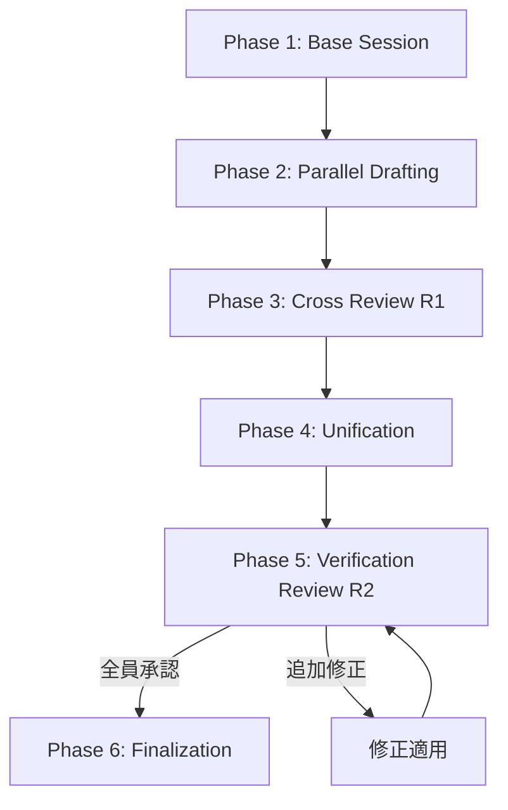

# マルチエージェント設計プロセス

本プロジェクトの設計ドキュメントは、3エージェント体制による反復レビュープロセスで作成される。

---

## エージェント構成

| 役割 | エージェント | モデル | 責務 |
| :--- | :--- | :--- | :--- |
| **Agent A** | Claude Ultra | `claude-ultra` | ドラフト作成、クロスレビュー |
| **Agent B** | Codex Ultra | `codex-ultra` | ドラフト作成、クロスレビュー |
| **Agent C** | Gemini Ultra | `gemini-ultra` | ドラフト作成、クロスレビュー |

3エージェントを並行起動し、成果物の統合とプロセスの進行を管理する。エージェント数は2〜3で運用可能。2エージェントでも十分に機能する（本プロジェクトでは 03, 04 を Agent A + B の2体制で完了した）。

---

## プロセス全体像

```
Phase 1: Base Session
Phase 2: Parallel Drafting
Phase 3: Cross Review (R1)
Phase 4: Unification
Phase 5: Verification Review (R2+N)
Phase 6: Finalization
```



---

## Phase 1: Base Session 作成

### 目的

各エージェントにプロジェクトの既存設計資料を読み込ませ、文脈を共有したセッションを確立する。このセッションは後続の全フェーズで再利用される。

### 手順

1. 読み込ませる資料を決定する（既存の確定済み設計書 + 原典資料）
2. 全エージェントを**並行起動**し、資料を読み込ませる
3. **指示は最小限にする** — 資料の理解のみ。要約・分析の指示は不要（アテンションの分散を防ぐ）

### 操作例

```
Agent A (Claude Ultra):
  prompt: "以下のファイルを読み込んでください。
    - concept.md
    - prd.md
    - docs/design/01_conceptual_architecture.md
    - docs/design/02_interface_contracts.md
    - docs/design/03_data_model.md"

Agent B (Codex Ultra):
  prompt: (同上)

Agent C (Gemini Ultra):
  prompt: (同上)
```

### 成果物

- 各エージェントの session_id（以降の全フェーズで使い回す）

---

## Phase 2: Parallel Drafting（並行ドラフト作成）

### 目的

同一の設計課題に対して、独立した複数のドラフトを生成する。視点の多様性を確保する。

### 手順

1. ドラフト作成の指示を策定する
2. 全エージェントを**並行起動**（Base Session を resume）し、同一の指示でドラフトを作成させる
3. 出力先はエージェントごとに分離する

### ディレクトリ構成

```
docs/design/
├── claude/
│   └── XX_<topic>_draft.md      # Agent A のドラフト
├── codex/
│   └── XX_<topic>_draft.md      # Agent B のドラフト
├── gemini/
│   └── XX_<topic>_draft.md      # Agent C のドラフト
└── XX_<topic>.md                 # 統合版（Phase 4 で作成）
```

### 注意事項

- ドラフト指示にはスコープ（何を設計するか）と参照仕様（何と整合させるか）を明示する
- 文書構成やフォーマットは指定しない — エージェントの自然な構成を活かす

---

## Phase 3: Cross Review（R1 クロスレビュー）

### 目的

各エージェントが**全ドラフト**を比較レビューし、強み・弱み・矛盾・改善案を抽出する。

### 手順

1. 全エージェントを**並行起動**（Base Session を resume）する
2. 各エージェントに**全ドラフト**を渡し、比較レビューを依頼する
3. レビュー結果をファイルに出力させる

### レビュー観点（指示に含める）

- 既存設計書（01, 02, 03...）との整合性
- PRD / コンセプトとの整合性
- コマンド・API・データモデルの実用性
- 仕様の曖昧さや未定義の振る舞い
- 各ドラフトの強み・弱み
- 統合案の提案

### 成果物

```
docs/design/claude/review_round1_<topic>.md
docs/design/codex/review_round1_<topic>.md
docs/design/gemini/review_round1_<topic>.md
```

---

## Phase 4: Unification（統合版作成）

### 目的

全ドラフト + 全R1レビューを読み込み、最適な統合版を作成する。

### 手順

1. 全ドラフトと全レビューファイルを精読する（3エージェント × 2 = 6ファイル）
2. 各設計判断について採用元を決定する
3. 統合版を `docs/design/XX_<topic>.md` として作成する

### 統合の原則

- **文書構造**: 簡潔で読みやすいほうをベースにする
- **設計判断**: 既存契約との整合性が高いほうを優先する
- **DX（開発者体験）**: 実用性が高い設計を優先する
- **矛盾の解消**: レビューで指摘された矛盾は統合時に必ず解決する
- 採用元の判断根拠を記録しておく（レビュー時の参考になる）

---

## Phase 5: Verification Review（R2+N 検証レビュー）

### 目的

統合版を全エージェントでレビューし、整合性・完全性を検証する。全エージェントが承認するまで繰り返す。

### 手順（1ラウンド）

1. 全エージェントを**並行起動**（Base Session を resume）する
2. 統合版のレビューを依頼する。指摘には重要度（High/Medium/Low）を付ける
3. 全エージェントの判定を確認する:
   - **全員「承認」** → Phase 6 へ
   - **「追加修正が必要」あり** → 修正を適用し、再レビュー（指摘したエージェントのみで可）

### レビュー依頼テンプレート

```
レビュー対象: docs/design/XX_<topic>.md

参照仕様:
- docs/design/01_conceptual_architecture.md
- docs/design/02_interface_contracts.md
- (他の確定済み設計書)

レビュー観点:
1. 既存設計書との整合性
2. 終了コード / 型 / API の一貫性
3. 仕様の曖昧さや未定義の振る舞い

レビュー結果を docs/design/<agent>/review_round<N>_<topic>.md に出力してください。
各指摘には重要度（High/Medium/Low）を付けてください。
```

### 確認レビュー（修正後の再検証）

修正後の確認レビューでは、前回の指摘が解消されたかを検証する。新規問題がなければ承認。

```
判定: 「承認」または「追加修正が必要」で回答してください。
追加修正が必要な場合は指摘を列挙してください。
```

### 収束条件

- **全エージェントが「承認」** を出した時点でレビュー終了
- 通常 R2 で承認されるが、整合ズレが残る場合は R3, R4... と繰り返す
- 実績: R2 で承認（03_data_model）、R2 + 修正確認 2回で承認（04_cli_design）

---

## Phase 6: Finalization（確定）

### 手順

1. 最終版を確認する
2. ドキュメントを「確定」とする
3. 次のドキュメントの Base Session に今回の確定版を追加する

### 確定後のファイル構成

```
docs/design/
├── XX_<topic>.md                         # 確定版
├── claude/
│   ├── XX_<topic>_draft.md               # Agent A ドラフト（アーカイブ）
│   ├── review_round1_<topic>.md          # Agent A R1 レビュー
│   └── review_round2_<topic>.md          # Agent A R2 レビュー
├── codex/
│   ├── XX_<topic>_draft.md               # Agent B ドラフト（アーカイブ）
│   ├── review_round1_<topic>.md          # Agent B R1 レビュー
│   └── review_round2_<topic>.md          # Agent B R2 レビュー
└── gemini/
    ├── XX_<topic>_draft.md               # Agent C ドラフト（アーカイブ）
    ├── review_round1_<topic>.md          # Agent C R1 レビュー
    └── review_round2_<topic>.md          # Agent C R2 レビュー
```

---

## セッション管理

### Session ID の追跡

各ドキュメントの Base Session ID を記録し、全フェーズで再利用する。

```
03_data_model:
  Agent A (Claude Ultra): c2a2affa-5cc9-487a-a107-c08a56613efe
  Agent B (Codex Ultra):  019c9a9b-4e21-73a2-85b9-8ab93085ed97

04_cli_design:
  Agent A (Claude Ultra): e32f594a-bb29-404e-a2a1-78610e8449d0
  Agent B (Codex Ultra):  019c9ade-aaf5-7643-be37-28bb58109803
```

### セッション継続性

- Base Session に読み込んだ資料はセッション内で保持される
- ドラフト作成 → レビュー → 確認レビューと、同一 session_id で resume することでコンテキストが蓄積される
- セッションが失効した場合は Base Session から再作成する

---

## Tips

### やるべきこと

- **Base Session は最小限の指示で** — 「読んで理解して」だけ。要約・分析を求めるとアテンションが分散する
- **ドラフト出力先はエージェントごとに分離** — 上書き事故を防ぐ
- **レビューには重要度を付けさせる** — High は必ず修正、Low は判断に委ねる
- **統合時に採用根拠を記録する** — 後のレビューで「なぜこの設計か」を説明できる
- **並行起動を活用する** — 全エージェントの起動は常に並行。待ち時間を最小化する

### やらないこと

- Base Session にドラフト作成やレビューの指示を混ぜない
- 1つのエージェントに自分のドラフトだけをレビューさせない（必ずクロスレビュー）
- 統合版を検証レビューなしで確定しない（必ず全エージェントの承認を通す）
- Low 指摘を無視しない（適用するか判断根拠を残す）
